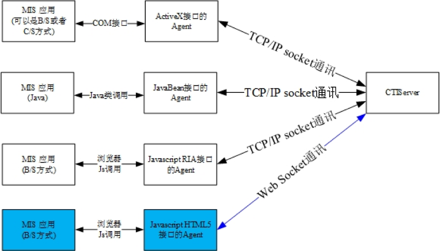
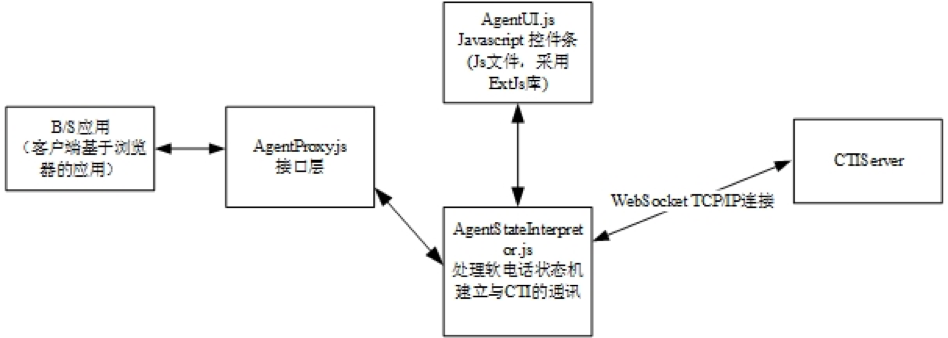

integine呼叫中心
----------------
本文档描述了HTML5版本的Agent（坐席）的使用、二次开发。
CTI平台针对坐席客户端，分别提供了ActiveX、JavaBean、JavascriptRIA、HTML5版本。
其中ActiveX提供的是符合ActiveX-COM标准的接口，JavaBean提供的是符合Java标准的接口，Javascript提供的是Javascript+(silverlight或Flash)版本的接口、而HTML5版本提供的是基于最新的支持HTML5浏览器的Javascript版本的接口(无需安装silverlight或者Flash，是真正意义的客户端零安装)。

在上述接口类型中，ActiveX接口是使用最广泛的接口模式。但是ActiveX接口需要在坐席端安装ActiveX控件，而相比较而言，Javascript-RIA接口利用了纯粹浏览器内置的Javascript客户端功能，附加以RIA技术(丰富客户端应用，以Flash和SilverLight为代表)，使得坐席端的功能以RIA方式实现，省略了ActiveX控件的安装要求（注：其实基于SilverLight和Flash的RIA应用也必须安装Flash和SilverLight浏览器插件，但是由于Flash和SilverLight已经成为业界事实的标准，大部分浏览器都已经安装）；而随着HTML5技术的成熟和主流浏览器的广泛支持，HTML5标准已经可以完成RIA插件所提供的主要功能，因此基于HTML5技术的接口无需坐席安装任何类型的插件，真正实现了客户端零安装。

目前对HTML5支持的浏览器版本要求:

|浏览器|版本支持|
|------|--------|
|Chrome|最低支持版本: 4+|
|Firefox|最低支持版本: 4+|
|Internet Explorer|最低支持版本: 10+|
|Opera|最低支持版本: 10+|
|Safari|最低支持版本: 5+|

本文详细介绍Javascript HTML5接口，为基于Javascript HTML5接口开发Agent业务功能的技术开发人员提供相关的支持。

读者：采用JavaScript开发BS座席业务系统的技术人员。

MIS：Manager Info System（管理信息系统），即呼叫中心人工服务业务系统。

Javascript HTML5 Agent与MIS系统

如上图所示，所有类型的Agent都是通过Socket与CTIServer建立TCP/IP连接；并且，不同类型的Agent都通过标准接口被MIS应用系统所调用。其中，Javascript HTML5标准的Agent采用的是WebSocket。

本文只详细描述Javascript HTML5接口

以下是Javascript HTML5接口的具体逻辑结构图：

如上图所示，Javascript HTML5版本的Agent提供了3个模块：
* AgentUI.js
  * Javascript控件条部分（UI界面部分，采用了ExtJS库），专门负责坐席界面的显示，以及各种对话框的显示：这个js里面关于界面的实现，完全可以换成其他的js界面实现，比如纯html、JQueryUI等等。
* AgentStateInterpretor.js
  * Javascript处理软电话状态机和与CTI通讯部分 
* AgentProxy.js
  * 提供了上层调用的接口函数和回调事件

由上图结构可见，Agent HTML5的HTML5部分并不是用来绘制界面的，而是利用了其WebSocket通讯功能，做底层的通讯部分和状态处理部分。界面部分是借由ExtJS的js库完成的。而界面部分是可以替换成其他的js实现的。

其他
------------
