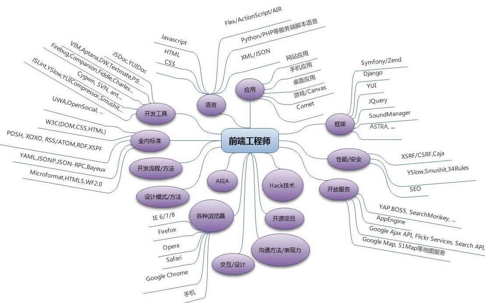

前言
-------

本文是在吴亮(月影)的原文基础上做了更新。
```
原文地址：https://www.h5jun.com/post/to-be-a-good-frontend-engineer
```

什么是前端工程师？
------------------

前端工程师是互联网时代软件产品研发中不可缺少的一种专业研发角色。从狭义上讲，前端工程师使用HTML、CSS、JavaScript等专业技能和工具将产品UI设计稿实现成网站产品，涵盖用户PC端、移动端网页，处理视觉和交互问题。从广义上来讲，所有用户终端产品与视觉和交互有关的部分，都是前端工程师的专业领域。

前端工程师的发展之路和前景是怎么样的？
--------------------------------------

前端是一个相对比较新的行业，互联网发展早期（1995年~2005年）是没有专业的前端工程师的。随着互联网的发展，大约从2005年开始，正式的前端工程师角色被行业认可，到了2010年，互联网开始全面进入移动时代，前端工程师的地位越来越重要，前端领域的技术发展也越来越快，各种新的思想、设计模式、工具和平台都快速发展，对前端工程师的技能要求也越来越高。

在2010年之后最流行的新编程语言中有相当部分和前端有关，比如 Dart、Clojure、CoffeeScript和TypeScript。

作为前端最重要的编程语言JavaScript，在最近几年里不论是代码量还是关注数都稳居Github平台热门编程语言榜。

行业对前端需求量持续增加，前端程序员薪水在行业里面处于较领先的位置。

前端工程师需要什么样的知识和技能？
----------------------------------

有人说前端工程师的技术栈是这样的：




